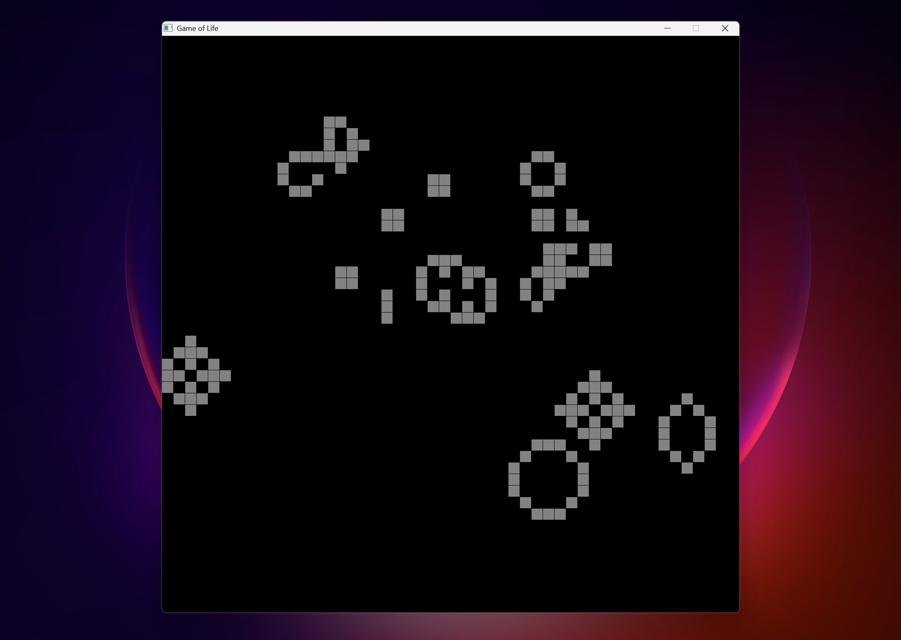
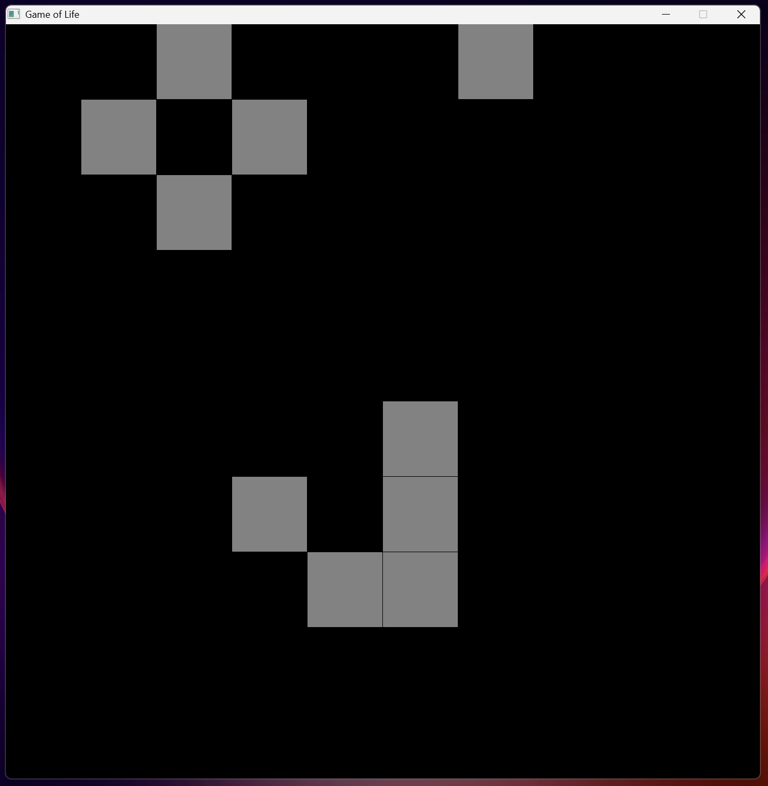

# Game of Life
## Feature-list
- Variable grid
- Cells switch state upon mouse press
- Updates upon spacebar press
## Screenshots
| 50x50 Grid | 10x10 Grid |
|------------|------------|
|  |  |

## Dependancies
- Raylib
## Build instructions
- Assuming raylib is on the path ~ 
### UNIX
```
 ++ main.cpp objects.h -lraylib
```
### WINDOWS
```
g++ -o main.cpp objects.h -Ipath_to_raylib/include -Lpath_to_raylib/lib -lraylib -lopengl32 -lgdi32 -lwinmm
```
## TODO
- Include a dependancy directory 
- Implement a propper buildsystem with CMake
- Refactor void update(); to make it faster
- implement auto update
- scrolling and zooming
